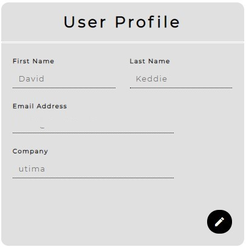

# **MILESTONE PROJECT FOUR**

For Milestone Project Four, which requires the development of a full stack site utilising Django dataset, users can subscribe a project to a cost report and management tool, Cost Report, to track the cost of changes occuring on a construction project.  Subscribing on a project-by-project basis, once a project is subscribed, the cost changes can be monitored.  Additional users can also be invited to be project users, and their privileges can be set to view only or edit permission.

The website can be viewed [here](https://ms4-cost-report.herokuapp.com/)

## **UX**

### **Who is the Website for?**

The website is for Developers, Cost Consultants and Project Managers of buidling projects.  They can subscribe to a service which will allow them to monitor and manage construction costs in a live, always up-to-date and transparent way.

Milestone Project 4 (MS4) shares similar purposes to Milstone Project 3 (MS3):-

***1. View the current cost position*** 
*The website shall enable the developer, and other persons involved and with access, the ability to view the live, current cost position of the development.*

*Whilst the developer will probably be most interested in the Total Cost, other users may be more interested in the list of changes - and their individual cost impact.*

***2. Implement Consistent, Best Practice Cost Control*** 
*The website shall enable the Cost Managers - those responsible for managing and reporting the current cost position of the development - to report costs immediately as they arise on a project.*

*The website will provide a consistent approach in the reporting of costs and changes, from project to project.  This will support familiarity and understanding for users.*

MS3 was designed to be implemented by users for their own use, it was not designed to be a service offering for the public.  The website would be hosted and managed for the developer's own use.

The purpose of MS4 is to offer these services and benefits to anyone through a subscription service.  Projects are private and only visible to Project Users that the Project Owner nominates.

 

### **User Stories**

In my previous [Milestone Project (MS3)](https://github.com/dkeddie/MS3), I introduced and developed a website to take the place of an Excel Spreadsheet.  That project sought to replicate the detail of the spreadsheet into an application.

Milestone Project 4 (MS4) seeks to take the principles of MS3 and develop a scalable platform for users to subscribe to that service.  Whereas MS3 would require users to implement a closed, secure website for private use, MS4 establishes an open platform with user authentication for security, so that property developers can manage and track construction costs with their team.

 **Item** | **Experience** | **Objectives**
---------|:----------------|:---------------
&nbsp; | ***Viewing & Navigation*** | &nbsp;
1 | View list of projects that I can access | View and edit the project cost tracker
2 | View list of changes | Track the costs affecting a project
3 | View a cost summary | See the initil and forecast cost of a project
&nbsp; | ***Registration and User Accounts*** | &nbsp;
4 | Easily resiter for an account | Have a personal account and view my profile
5 | Receive an email confirmation when registering | Verify that my account resitration was successful
6 | Have a personalised user profile | View my projects/subscriptions, projects I can access, payment history and save my payment information
7 | Invite users | So that I can include users to participate on my project
&nbsp; | ***Sorting and Searching*** | &nbsp;
8 | Search for a specific change by name or descriptions | So that I can quickly filter changes
&nbsp; | ***Cost Tracker Items*** | &nbsp;
9 | Add a new change item | Track the latest cost position of the project
10 | Edit a change item | Update costs if they change on my project
11 | Upload associated change information (drawings, cost information, etc)
&nbsp; | ***Subscribing*** | &nbsp;
12 | Create a new project by subscribing for the monthly project | Start to monitor the costs of a construction project
13 | Enter payment details for recurring payments | Checvk out quickly with no hassles
14 | Switch off recurring payments | Stop subscribing
15 | Feel my personal and payment information is safe and secure | Confidently provide the needed information to make a purchase
16 | View an order confirmation after checkout | Verify that I haven't made any mistakes
17 | Receive confirmation after each payment | Be notified of payments from my account
18 | View a history of payments | Verify all past payments
&nbsp; | ***Admin and Project Management*** | &nbsp;
19 | Delete a project | Permanently remove the data from the database
20 | Add/Remove users to my project | Control access to my project

 

## **Functions and Requirements of the Website**

The functions of the website are to:-

### **Django Full Stack Project**

The website **Cost Report** is built around a Django backend and SQL relational database.  Users must register to use the website.  To use the website, a user must either subscribe and add a project, or be invited by another project owner to participate on a project.

 
 

### **Multiple Apps**

The **Cost Report** project is composed around multiple Apps as can be seen in the image below.

 
 

### **Data Modelling**

A relational database has been designed to link the users, projects, changes and payments to enable the project to work.  A schema of the database is shown below.

 
 

### **User Authentication**

The website utilises Django Allauth to manager user registration, verification, logging in and user management.  Registration is required as a pre-requisite to use the website.
   

Once registered, a user may add a project (and subscribe) to monitor the cost of a construction project, or be invited to participate on another project.
 
 

### **User Interaction**

The project relies on user interaction to create a Project and to monitor the changing estimated cost of the project by recording any changes that arise on the platform.

A user will record a Change, including the Name, Cost, Status and any associated documents which relate to the Change.

Although not shown in the clip above, the user can continue to interact.  Details of the change can be amended on the Edit screen, additional attachments can be added or deleted, and the change itself can be deleted (if the user has the requisite permission).
 
 

### **Use of Stripe**

In order to track the costs of a Project, a user has to create a subscription for that project first.  Once the subscription has been activated, and so long as the payments continue to be processed on the cycle selected, then access to view the latest project cost estimate and list of changes on the Dashboard is accessible by the project owner and any other users they have provided access to.

 
 

### **Structure and Navigation**

The website utilises Bootstrap 4 to enable a responsive UI for mobile and desktop users. This is further documented [here](#Responive-UX-Design)
 
 

### **Use of Javascript**

Javascript has been used in a number of ways to enhance a user's frontend experience.  For example:-

1. Use of [DataTables](https://www.datatables.net) - Datatables is used across the project to order and present any lists in an ordered format (e.g. projects, changes and attachments). Each of the tables have been formatted individually to operate in an optimised manner according to the table.  An example is the Projects list on the home page:-  

2. Stripe - Javascript required to operate Stripe payments on the frontend has been utilised.

3. Editing Details - in order to protect details, read-only fields have been applied to forms which are displayed on-screen.  To make editing efficient, those forms can be made editable due to Javascript coding e.g. :-  

4. Clickable Row - to make the rows clickable =, for example to open the Change to to view / edit details:-  

 
 

### **Documentation**

A README.md file has been prepared which explains what the project does and the value it provides to its users.
 
 

### **Version Control**

Git was used for version control in combination with the following pre-fixes, which are taken from the Commit Message Guidelines outlined by [Angular Framework](https://github.com/angular/angular/blob/22b96b9/CONTRIBUTING.md#-commit-message-guidelines):-
  * feat: new feature has been added to the code
  * fix: bug fixed during on-going testing
  * refactor: 'tidy up' of code
  * docs: addition of comments to code or writing of README file
 
 

### **Attribution**

See [here](#Credits)
 
 

### **Deployment**

See [here](#Deployment)
 
 

### **Security**

Whilst in Development, dotenv and an env file was used to protect sensitive information, usernames, passwords and the like from being pushed to GitHub and exposed, and accessed via os.environ logic.

In Production, this sensitive information has been stored in Config Vars and accessed in the same way as in Development.

Once deployed and tested, the DEBUG has been turned off on the Production version on Heroku.

 
 

___
 

## **Design**

### **Responive UX Design**

The website has been designed for use across multiple screen sizes, adapting content display to optimise the information to be displayed.

Content is optimised on screen sizes that are greater than 500px, as the context boxes which can be seen on-screen are generally 500 x 500.  This enables a full and consistent user experience across a large number of devices.

Where content boxes can no longer fit side-by-side in landscape format, the layout adjusts to portrait / vertical format. This is enabled by Bootstrap grid system adjusting to the screen size break points.

This also means that in landscape mode, most devices will meet function without compromise.

Below 500px, all content is still provided, however some formatting is adjusted to suite the narrow resolution.

 

### **Key concepts**
The website will be a cost management tool for developers to monitor and track the cost of changes on a construction project. The concept is that developers will be able to easily apply the principles developed in MS3 through a subscription service.

By hosting the application online as a subscription service, it will enable more developers, or project managers or cost consultants, to use the service for better cost management of construction projects. Also, as an open platform, the service will become familiar with a wide audience, used across projects, developers and consultants.

 

### **Wireframe**

Figma was used to develop a key concept into framework for developing the web page / app.  Only a desktop framework was formulated at this stage.

A copy of the original wireframe can be found here: [Figma](https://www.figma.com/file/fRdNEUuVDSEQglHmwov15H/MS4?node-id=0%3A1) or [PDF](README/Figma.pdf)

 

### Typography

The [Montserrat](https://fonts.google.com/specimen/Montserrat) font (from Google Fonts) is the only font used throughout the whole website with Sans Serif as the fallback font in case for any reason the font isn't being imported into the site correctly.

 

___

## Features

### Existing Features

### Database

In order to implement CRUD (Create, Read, Update, Delete) functionality on the website, an SQL database was used - sqlite in Development and postgres in Production.

### Features to Implement in the Future

The functions implemented on this website are for demonstration purposes only at this stage, there is further development required before the website can be deployed for a live development.  Those features required before live deployment include:-

* **Add non-registered users:** At the moment, if an un-registered user is added as a Project User, that user is sent an email suggesting that they join. However, they will not automatically be added as a Project User if they do register. This feature should will be added.
* **Reform how subscription system operates:** 
  - Any user can create *one* project, without a subscription, but cannot add users.
  - To add users or additional projects, users will need to subscribe to a tier system.
  - The tier system will allow subscribers to select a number of projects on a subscription basis.

  The benefit of this reformed subscription basis is that it will allow all users to create a project and experiement with the application.  The benefit of the website is sharing the project with other users, so this should encourage new users to experiment and see the benefits, and be encouraged to subscribe.
* **Graphical Representation:** To enhance and make the user experience more engaging, the Dashboard can benefit from graphs or other figurative representations of the data in a more visually absorbing way.

 

## Technologies Used

### Languages Used

* [HTML5](https://en.wikipedia.org/wiki/HTML5)
* [CSS](https://en.wikipedia.org/wiki/Cascading_Style_Sheets) 
* [Javascript](https://en.wikipedia.org/wiki/JavaScript)
* [Python](https://www.python.org/)
* [Django](https://www.djangoproject.com/)

### Frameworks, Libraries and Programmes Used 

* [PostgreSQL](https://www.postgresql.org/)  
PostgreSQL provides the backend database for storing the information submitted from, and viewed on, the website.

* [Bootstrap 4](https://getbootstrap.com/docs/4.0/getting-started/introduction/)  
Bootstrap has been used to assist with the layout, utilising the in-built grid system, and design functionality.

* [Google fonts](https://fonts.google.com/)  
Google fonts is used to import the 'Montserrat' font into the base.css file which is used throughout the project.  In addition, [Material](https://fonts.google.com/icons) icons have been utilised.

* [jQuery, incl UI](https://jquery.com/)  
jQuery is used for Javascript DOM manipulation.

* [Git](https://git-scm.com/)  
Git was used for version control by utilizing the terminal in VSCode terminal to commit and push changes to GitHub.

* [GitHub](https://github.com/)  
GitHub is used to store the projects code after being pushed from Git.

* [Heroku](https://www.heroku.com/)  
Heroku is used for deployment of the website / application.

* [Figma](https://www.figma.com/)  
Figma was used to create the wireframes during the design process.

* [Screen Recorder](https://chrome.google.com/webstore/detail/screen-recorder/hniebljpgcogalllopnjokppmgbhaden)  
Screen Recorder used for creating videos (edited in Kapwing) of website features in operation.

## Testing

### User Story Feedback and Testing

**1** | **Vew list of projects that I can access**
---------|:----------------
(a) | Users can view a list of projects that can be accessed on the Home page
(b) | 
_____________
 

**2** | **View list of changes**
---------|:----------------
**3** | **View a cost summary**
(a) | Users can view the cost summary of a project and list of changes through the Dashboard App, which they can access from the Home page by clicking the 'View' button
(b) | 
_____________
 

**4** | **Easiliy register for an account**
---------|:----------------
**5** | **Easily login or logout**
**6** | **Easily recover my password in case I forget it**
**7** | **receive an email confirmation when registering**
**8** | **Have a personalised user profile**
(a) | The 'Sign Up' and 'Log In' pages control access to the application.
(b) | The User Profile can be viewed on the Home Page.
(c) | 
(d) | Users can recover access by clicking the 'Forgottin Password?' link on the 'Sign In' page.
(e) | When registering, users must validate their email address before they can gain access to the application.
(f) | The 'Sign Up' process creates a personalised user profile.  Additional details may be added through the Payment process, however all details are linked through the inital user profile set up in the registration process.
(g) |    
_____________
 

**9** | **Invite users**
---------|:----------------
(a) | A Project Owner will be able to invite additional registered users to participate on a project through the Admin button on the 'Home' page.
(b) | If a user is not register, an email will be sent inviting them to join Cost Report, however they will not be added to the Project Users.  The Project Owner will have to re-invite them again once they have registered.
(c) | 
_____________
 

**10** | **Search for a specific change by name or description**
---------|:----------------
(a) | Search terms can be inputted into the Search box to narrow the list of items
(c) | 
_____________
 

**11** | **Add a new change item**
---------|:----------------
**12** | **Edit a change item**
**13** | **Upload associated change information (drawings, cost info., etc)**
(a) | The latest cost position can be seen on the Dashboard.  If any new change is added to the project, this Dashboard will update to show the revised cost estimate.
(b) | Change items can be editted by clicking on them on the List. If the cost is changed, the Dashboard estimates will be updated.
(c) | Associated documents relating to the change can be uploaded.  One or more document can be uploaded at a time, and the list of these documents can be viewed by clicking on the change in the 'List of Changes'
(d) | 
_____________
 

**14** | **Create a new project by subscribing**
---------|:----------------
**15** | **Enter payment details for recurring payments**
(a) | Users can add a project and choose a subscription method, daily, monthly or yearly, in order to start tracking the construction costs of a project.
(d) | 
_____________
 

**16** | **Switch off recurring payments**
---------|:----------------
**17** | **Feel my personal and payment information is safe and secure**
**20** | **View a history of payments**
(a) | The subscription can be controlled, including changing the plan or cancelling the subscription, by going to the 'Admin' page and 'Manage Subscription'
(b) | The 'Manage Subscription link redirects to a Stripe portal. The user subscription and payment details are hosted on the Stripe portal, not the Cost Report website. This provides a higher level of security than could be achieved on the Cost Report website.
(c) | A history of payments is included on the portal.
(d) | 
____________
 

**18** | **View an order confirmation after checkout**
---------|:----------------
**19** | **Receive confirmation after each payment**
(a) | A confirmation page is displayed when the subscription and payment have been processed. The page will only show for a few seconds but there is a link to the Stripe portal should users wish to review the details.
(b) | When Stripe activated, users will also receive payment confirmation emails through Stripe. (Stripe does not send emails in Test mode)
(c) | 
____________
 

**21** | **Delete a project**
---------|:----------------
(a) | A Project Owner can delete the Project through the 'Admin' panel.
(b) | In order to ensure a Project is not accidentally deleted, defensive programming is implemented - a confirmation page ensures no accidental clicking, which is reinforced by requesting that users correctly enter their email address to confirm the deletion.
(c) | 
(d) | A confirmation email is also sent to the Project Owner.  The email provides a link to the Stripe Portal, as Users may want to confirm that the subscription has been cancelled, remove any Payment details and/or review past payments.
(e) | 

____________
 

**22** | **Add/Remove users to my project**
---------|:----------------
(a) | A Project Owner can add users to participate on their projects through the 'Admin' page.
(b) | A list of Users is maintained on this page.
(c) | Users can be removed from the Project by clicking the 'Remove' button.  A prompt to confirm the removal will confirm the deletion of the user from the Project.
(d) | When a user is added to the Project, the Project will appear in that users 'Home' page the next time they log in.
(e) | 
____________
 

### Validators

The W3C Markup Validator and W3C CSS Validator Services were used to validate the main pages of the project to ensure there were no syntax errors in the project.

**[W3C Markup Validator](https://validator.w3.org/)**

To view the links, please use *Validation credentials* to login in order that the links function correctly.

**Results**
  - Home - [Results](https://validator.w3.org/nu/?doc=https%3A%2F%2Fms4-cost-report.herokuapp.com%2Faccounts%2Flogin%2F%3Fnext%3D%2F)

  - Dashboard - [Results](https://validator.w3.org/nu/?doc=https%3A%2F%2Fms4-cost-report.herokuapp.com%2Fdashboard%2Fproject%2F1%2F)

  - View / Edit Change - [Results](https://validator.w3.org/nu/?doc=https%3A%2F%2Fms4-cost-report.herokuapp.com%2Fdashboard%2Fproject%2F1%2F)

  - Admin - [Results](https://validator.w3.org/nu/?doc=https%3A%2F%2Fms4-cost-report.herokuapp.com%2Fproject%2F1%2Fadmin%2F)

There are no errors highlighted by the validator, however there are some warnings which should not cause the website to malfunction.

 

**[W3C CSS Validator](https://jigsaw.w3.org/css-validator/)** - [Results](https://jigsaw.w3.org/css-validator/validator?uri=https%3A%2F%2Fms4-cost-report.s3.amazonaws.com%2Fstatic%2Fcss%2Fbase.css&profile=css3svg&usermedium=all&warning=1&vextwarning=&lang=en)

There are no errors highlighted by the CSS validator.
 
 

### Javascript Code Quality - JSHint

[JSHint](https://jshint.com/) has been used to check and test the Code Quality of the Javascript used on this page.  Each of the JS pages included within the both the main base.js file and each of the App static JS files has been passed through jshint.com.

There are no outstanding warnings.

 

### Python compliance with PEP8

[PEP8 online](http://pep8online.com/) has been used to check compliance of the app.py file used in this application with PEP8 requirements.  The file was updated in line with non-compliance results that were initally returned.

There are no non-compliance remaining in the app.py file.

### Manual Testing of the Site

The following tests were carried out to ensure functionality before deployment:-

**Test**: Two projects with the same name:
  * Add two projects to ensure that page loads correctly (no duplicate errors)
  * Add a user to *one* of the projects
  * Ensure that only the correct Project is displayed in the invited user's 'Home' page
* Results: If two projects had the same name, they would both be displayed in the invited user's 'Home' page and be accessible. 
* Fix: This was resolved by filtering the projects by 'id' rather than 'project_name' when selecting projects in the Home view.

**Test**: Try to register with the details of a User already in the database
* Steps followed:-
  1. Attempt to sign up with register email address and new username
  2. Attempt to sign up with new email address and registered username
  3. Attempt to sign up with registered email address and username
* Results:-
  * In all cases, a warning is displayed that a user is already registered with that username and/or email address.

**Test**: Try to change the email address of a user to one that is already in the database
* Steps followed:-
  1. Change/update the email address on the 'Home' page - User Profile section.
* Results:-
  * The email address will update, allowing duplicate email addresses.
  * On further investigation, the email address under 'Users' model changed but the email under 'Accounts' did not.
  * The required outcome should be that:-
    * If duplicate email is entered, the email address should not be changed.
    * If the email is unique, both the 'Users' and 'Accounts' email addresses should be updated.
* Fix:-
  * The code was updated to ensure that there can be no duplicate user emails.
  * Additional code was added to update the EmailAddress model so that both the User and EmailAddress emails match when an email is updated

        if user.email != email:
            try:
                update = User.objects.get(email=email)
                messages.error(request, f'{email} already registered to another user')
            except User.DoesNotExist:
                # Update User model
                update = User.objects.get(pk=user.id)
                update.email = email
                update.first_name= firstname
                update.last_name = lastname
                update.save()
                # Update EmailAddress model so that emails match
                newemail = EmailAddress.objects.get(email=user.email)
                newemail.email = email
                newemail.save()

                obj, created = UserProfile.objects.update_or_create(
                user=user,
                defaults={'company': company},
                )

During the on-going testing and development of the site, bugs were discovered and resolved.  These can be reviewed in the list of Git commits, specifically those with the 'fix' prefix.

For a list of the Git Commit history, this can be viewed [here](https://github.com/dkeddie/MS4/commits/master)

### Further Testing

During the development of the website, and again as a final, comprehensive and in-depth review, the following testing was carried out:-

* The Website was tested on Google Chrome, Internet Explorer, Microsoft Edge and Safari browsers.
* The website was viewed on a variety of devices: Desktop, Laptop, iPad.
* Buttons were checked to ensure when hovered or active that they are responsive and operate uniformly.

### Known Bugs

* **Project Options don't display correctly on initiation of Subscription**  
  * After a new project has been created, and the Payment has been processed, the options for the Project do not initially display correctly.  This is rectified on a refresh.  
  *   
  * Fix: Additional code added to webhook function to create subscription object:-  

        # Set project subscription status to True
        # Inital page will load correctly
          project.has_subscription = True
          project.save()

## Deployment

### For Development Purposes

The website has been deployed on Heroku and is currently publicly accessible.  
The development of the website has been undertaken on VSCode.  

The steps from start to present were:-

**Connection to GitHub repository**

  1. Creation of repository on GitHub, utilising Code Institute template.
  2. Clone of GitHub repository to local machine but utilising GitBash to implement the command:-
  `git clone https://github.com/dkeddie/MS4.git`

**Set up AWS S3 account** (to host static files and other media/uploads)
  3. Create and set up an AWS S3 Bucket
  4. Install boto3 and django-storages through pip
  5. Add 'storages' to INSTALLED_APPS in settings.py
  6. Update settings.py to use AWS for file storage
  7. Create a custom_storages.py file in the main directory and set new classes for storage to the S3 bucket

**Deployment to Heroku**

  8. Creation of a new App on Heroku
  9. Go to 'Deployment Method' -> Select 'GitHub' and search for the repository that you want to deploy via Heroku from GitHub.  
  
  10. Go to 'Settings' and 'Reveal Config Vars' -> Input the settings required to deploy the website and connect to the Mongo Database as shown below:-  
  
  
  11. Go to 'Deploy' and select to Enable Automatic Deploys
  

The website is now deployed and can be viewed at:
    [https://ms4-cost-report.herokuapp.com/](https://ms4-cost-report.herokuapp.com/)  
 

## Cloning of the Repository

Should you wish to deploy your own version of the website, the following steps may be followed to host your own version on GitHub:-

1. Visit my GitHub Repository: [MS4](https://github.com/dkeddie/MS4)

2. Click dropdown 'Code' and copy url to 'Clone with HTTPS'  

3. Select 'Import Repository' from the Menu dropdown, paste the url, give your new repository a name and click 'Begin Import'  

4. Go to your new Repository.  You may chose to launch the repository in an IDE of your chosing in order to make changes to the website, and customise it to your requirements.

5. To deploy the website, follow step 3 of the **Deployment** section immediately above.

## Credits

### Content

All content and code was written by the developer, except where taken from libraries or documented within this file or the Code files.

### Code

* Clickable table rows - code to make the row clickable to View/Edit the item was taken from [electrictoolbox](https://electrictoolbox.com/jquey-make-entire-table-row-clickable/)

* Amend the allauth template to First and Last Name - to enable these details to be captured in the registration process, guidance followed [here](https://dev.to/gajesh/the-complete-django-allauth-guide-la3)

* Display Tuple in choices - for making choices in models / forms, guidance followed [here](https://stackoverflow.com/questions/54020156/display-value-of-choicefield-of-the-tuple-in-template-django)

* Uploading files - to upload multiple files at once, store in S3 and delete from model *and* AWS, difference sources were referred to (
  [1](https://b0uh.github.io/django-multiple-forms-in-one-class-based-view.html), [2](http://www.joshuakehn.com/2013/7/18/multiple-django-forms-in-one-form.html), [3](https://stackoverflow.com/questions/38257231/how-can-i-upload-multiple-files-to-a-model-field), [4](https://medium.com/@bhagyalakshmi18/uploading-multiple-files-in-django-b2f5ede55d09)
)

### Acknowledgements

Thank you to my mentor for feedback and advice given throughout the project.